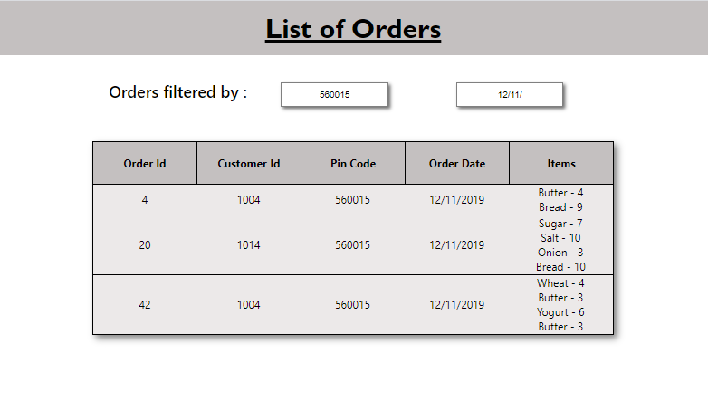

# OrderList with Search Option #
A simple react application that get the order details from ***.csv file***.

* ### Filter Orders by ###
              1. Pin Code
              2. Order Date

* ### To Start the Application on Local  : npm start
* ### To install npm packages : npm install package_name
        
